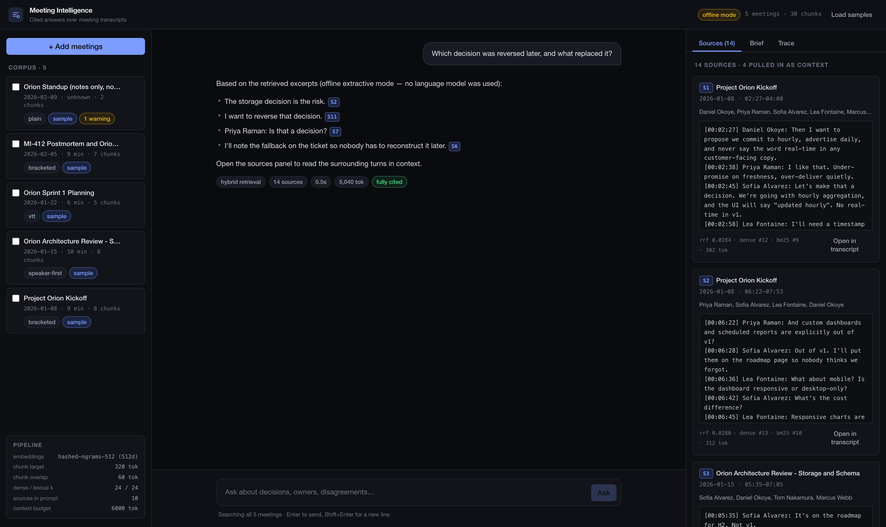
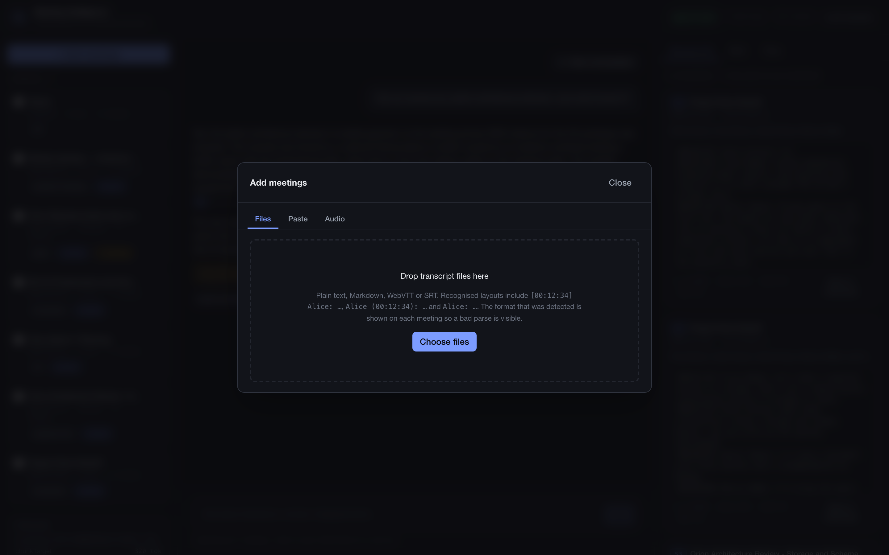
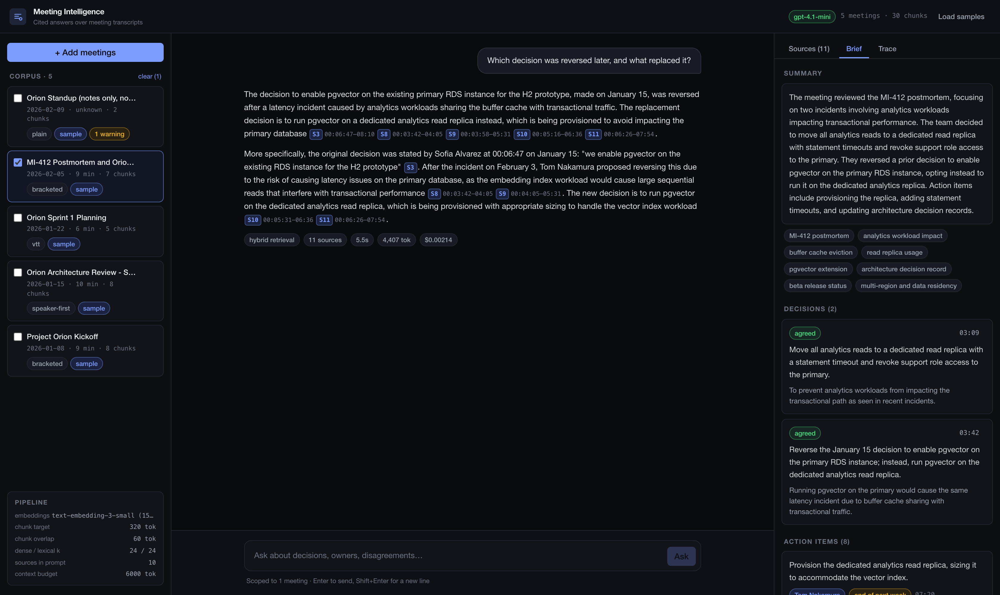
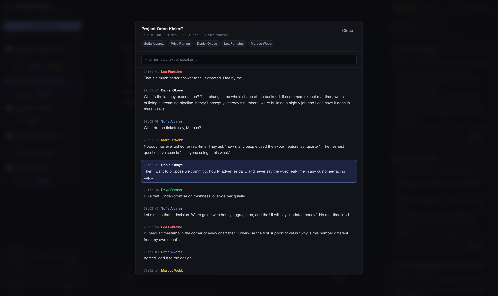
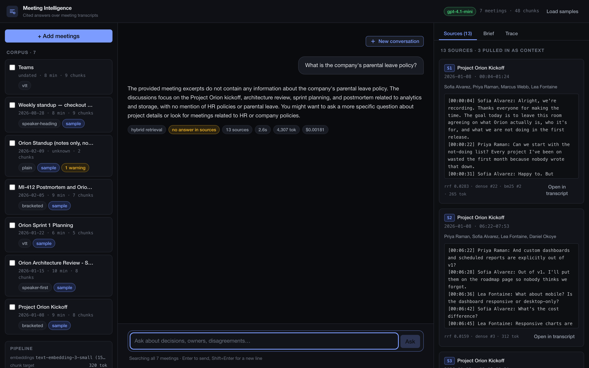
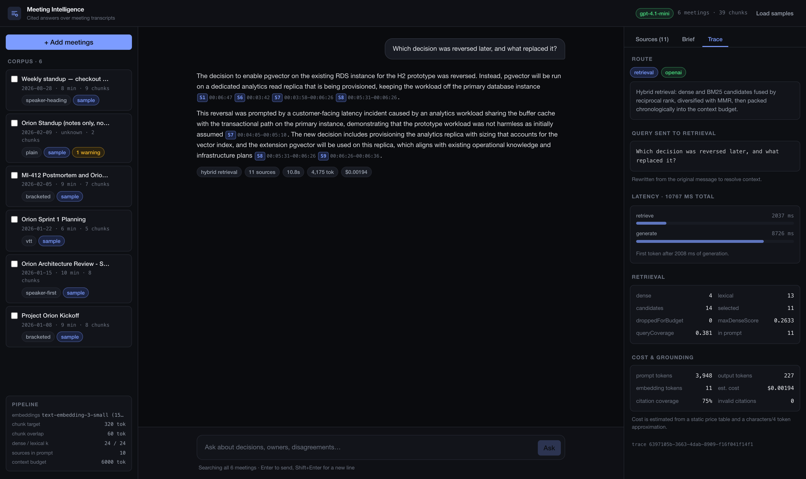

# Meeting Intelligence

Meeting Intelligence turns meeting transcripts into a searchable memory.

You can ask what the team decided, who owns an action, or whether a decision changed
later. Each answer links to the part of the transcript that supports it.

The project implements Option 3 of the assignment. It accepts transcripts with
speakers and timestamps. It answers questions about discussions, decisions, and
action items. It also supports audio transcription as the optional bonus.



## Quick start

Node 22.18 or newer is required.

```bash
npm install
npm run seed
npm run dev
```

Open [http://localhost:3000](http://localhost:3000).

The app works without an API key. In that case, it uses a simple offline mode. Search,
citations, and traces still work, but answers are copied from relevant excerpts rather
than rewritten by an AI model.

For full answer quality:

```bash
cp .env.example .env
# Add OPENAI_API_KEY to .env
```

Docker is also supported:

```bash
docker compose up --build
```

The main quality checks are:

```bash
npm test
npm run lint
npm run typecheck
npm run eval -- --answers
```

## What the app does

### Add meetings

A transcript can be uploaded or pasted. An audio file can also be transcribed.

The parser understands several common formats, including WebVTT, SRT, and Google Meet
exports. It keeps speaker names and timestamps so answers can link back to the right
moment.



### Read a meeting brief

Each meeting gets a short brief when it is added. The brief contains a summary,
topics, decisions, action items, owners, due dates, and open questions.

This information is prepared once. The app does not need to ask the model to read the
same meeting again for every common question.



### Ask questions with verifiable answers

Questions can search all meetings or only selected ones. Citations such as `[S1]` are
clickable. They open the transcript at the supporting passage.

Conversation history helps with follow-up questions such as “Who owns it?”. The
**New conversation** button clears that history when the subject changes.



If the meetings do not contain the answer, the assistant says so instead of guessing.



## Architecture

The application uses Next.js and TypeScript. The user interface and API run in one
process. SQLite stores the meetings, search data, and traces.

```text
Transcript or audio
        ↓
Parsing → speaking turns → searchable sections
        ↓
Semantic search + keyword search
        ↓
Relevant transcript excerpts
        ↓
Prompt → language model → cited answer
        ↓
Answer, sources, and trace in the interface
```

The code is separated by responsibility:

```text
src/lib/transcript/   transcript parsing and splitting
src/lib/providers/    online and offline AI providers
src/lib/store/        SQLite storage and search
src/lib/rag/          retrieval, answers, briefs, and guardrails
src/app/api/          application API
src/components/       user interface
```

The central logic does not depend directly on Next.js or OpenAI types. This makes it
possible to test retrieval without starting the website or calling an external API.

## RAG and LLM approach

### Why use RAG?

RAG means “Retrieval-Augmented Generation”. In simple terms, the app first searches
the transcripts, then gives only the useful passages to the language model.

Sending one complete meeting to a model is often the best option. The model sees the
whole discussion and nothing is cut out. The app uses this approach for a small number
of short, selected meetings.

It does not work well for a growing archive. Sending months of meetings with every
question would be slow and expensive. Important evidence could also be lost in a very
large amount of unrelated text. RAG keeps the amount of text small and makes questions
across several meetings practical.

### How transcripts are split

The app splits transcripts by speaking turn, not at an arbitrary character count.

This matters because a decision is usually a short conversation. One person proposes
an idea, another objects, and someone confirms the final choice. Cutting in the middle
can remove the meaning.

Neighbouring sections overlap slightly. This gives the search a better chance of
keeping a complete exchange together. Every section also keeps speaker names and
timestamps.

### How search works

The app combines two kinds of search.

Semantic search looks for similar meaning. It can connect “system capacity” with
“handling more traffic”. Keyword search looks for exact terms. It is better for names,
ticket numbers, and product codes.

The results from both searches are merged. Near-duplicates are removed. The app then
adds nearby transcript sections when they help complete the conversation. Sources are
shown in time order so a later decision is not confused with an earlier proposal.

### Models and database

The online setup uses `gpt-4.1-mini` for answers and
`text-embedding-3-small` for semantic search.

These models were chosen for their balance of quality, speed, and cost. The task is
mainly about finding information and attributing it correctly. A larger model would
cost more without clearly improving the current evaluation.

SQLite stores vectors as well as a full-text keyword index. A hosted vector database
was considered, but it would add setup and network calls to a small local project.
SQLite is simpler and fast enough for this corpus. At larger scale, Postgres with
`pgvector` would be a better fit.

LangChain and LlamaIndex were also considered. The final pipeline is written directly
in TypeScript. It is small, and its meeting-specific behaviour is easier to understand
and test without an extra framework.

### Prompt and context management

The model receives a clear set of rules. It must use only the supplied transcript
excerpts. It must cite factual claims. It must distinguish a proposal from a decision.
It must also prefer a later decision when it replaces an earlier one.

The amount of transcript sent to the model has a fixed limit. The strongest evidence
is added first, while complete speaking turns stay together.

Conversation history is used to understand follow-up questions. It is not treated as
evidence. Only the transcripts can support a factual answer.

## Guardrails, quality, and observability

The most important risk is a confident answer that the meetings do not support.

If search finds no useful evidence, the app refuses before calling the language model.
For less obvious cases, the model reads the excerpts and can decline to answer.

Every citation is checked against the sources that were actually sent to the model.
Unknown citations are removed. The app also measures how many factual sentences have
a citation. A warning appears when citation coverage is low.

Transcript text is treated as data, not as instructions. This reduces the risk that a
sentence spoken during a meeting can change the behaviour of the assistant.

### Evaluation

The evaluation set contains 16 hand-written questions. It checks whether search finds
the evidence needed to answer, whether unsupported questions are refused, and whether
citations are valid.

The latest online run produced:

```text
Retrieval recall       100% (16/16)
Correct refusals       100% (16/16)
Citation coverage      70.5%
Invalid citations      0
Median answer time     2.6 seconds
Estimated cost         $0.031 for 16 questions
```

Citation coverage varies between runs because generated wording changes. It has ranged
from 60% to 78%. Retrieval recall and citation validity remained stable.

Tests always use the offline provider. They are deterministic, free, and cannot spend
API credits by mistake. The project currently has 103 unit and integration tests.

### Observability

Each question receives a trace ID. The trace records the search query, selected
sources, time spent in each stage, token usage, and estimated cost.

The same information is available in the interface. When an answer is wrong, this
helps identify whether search missed the evidence or the model misunderstood it.



## Key technical decisions

The project favours simple local components. One Next.js process and one SQLite file
make the app easy to run and review. The trade-off is limited scale.

Meeting briefs are created during ingestion. This makes common questions faster and
more consistent. The trade-off is that a change to the brief format requires meetings
to be processed again.

The offline provider is a real application mode rather than a test mock. This keeps
development and automated tests independent from external services. Its answers are
less natural, and it is not reliable enough to judge difficult refusals.

Answer quality is measured instead of assumed. Retrieval recall has a minimum required
score, and changes to parsing, citations, or refusal behaviour are covered by
regression tests.

## Engineering standards

The code uses strict TypeScript. Responsibilities are separated into parsing,
storage, retrieval, providers, API routes, and interface components.

Tests cover transcript parsing, text splitting, search, context limits, guardrails,
citations, ingestion, streaming, and traces. Lint and type checks pass. Secrets are
excluded from Git. The Docker image uses several build stages and runs as a non-root
user.

Some standards were intentionally left out for this assignment. There is no
authentication, multi-tenant isolation, database migration system, or CI
configuration. Browser automation captures screenshots but is not yet a complete
end-to-end test suite. Accessibility has not received a full audit.

These choices are acceptable for a local demonstration. They would need to change
before handling real company meetings.

## Production and scaling

The main production change is to move state out of the application process.

On AWS, Aurora Postgres with `pgvector` could replace SQLite. S3 could store raw
transcripts and audio. SQS workers could process large uploads outside web requests.
The Next.js app could run on ECS Fargate behind a load balancer. Secrets Manager could
hold credentials. Existing traces could be sent to CloudWatch or Datadog with
OpenTelemetry.

This architecture would allow several application instances to run at the same time.
Large uploads would no longer block the website.

Security would be essential. Every record and query would need a tenant identifier.
The product would also need SSO, encryption, an audit log, rate limits, and usage
budgets. Meeting transcripts are sensitive and should be private by default.

The retrieval evaluation should run in CI whenever prompts, splitting, or search
changes. Repeated question embeddings and meeting briefs could be cached. Embeddings
should be created in batches to reduce cost.

## What I would improve with more time

The first retrieval improvement would be a reranking model. It would examine the best
search results more carefully before choosing the final context.

The next infrastructure step would be Postgres with `pgvector`. Answer evaluation
could also use a language model to compare generated answers with reference answers,
instead of relying partly on expected words.

Audio transcription needs speaker diarisation. Today it can produce the words but may
not identify speakers reliably. This weakens attribution.

Before deployment, I would add authentication, tenant isolation, database migrations,
CI, and end-to-end browser tests. I would also reprocess only changed meetings when the
splitting strategy changes, instead of rebuilding the full index.

## Known limitations

Offline mode is useful for development but does not match online answer quality.
Difficult refusals require a model call and therefore add latency and cost.

Vector search scans every stored vector. This is fine for a small corpus but will need
an index at larger scale.

The final turn of a transcript has no following timestamp, so its end time is
estimated. Transcripts without timestamps can still be searched, but citations cannot
open an exact moment.

Cost values are estimates based on a static price table.
