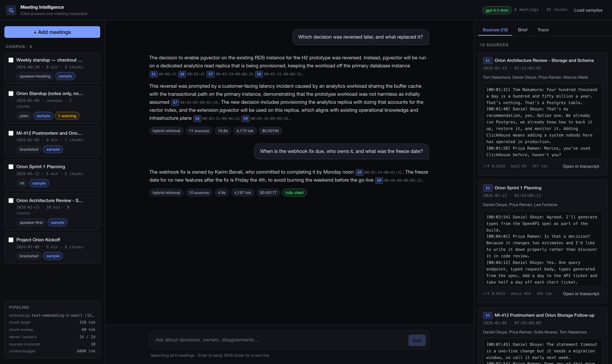

# Meeting Intelligence

Meeting Intelligence turns meeting transcripts into a searchable memory.

You can ask what the team decided, who owns an action, or whether an old decision
changed. The answer does not stand on its own. Each claim links to the exact part of
the transcript that supports it.

The app covers the Meeting Intelligence option in the assignment. It accepts
transcripts with speakers and timestamps. It answers questions about discussions,
decisions, and action items. It can also transcribe audio.


## Run it

You need Node 22.18 or newer. The Docker image uses Node 24.

```bash
npm install
npm run seed     # index the six sample transcripts
npm run dev      # open http://localhost:3000
```

No API key is required for a first look. Without `OPENAI_API_KEY`, the app uses a
deterministic offline provider. Upload, search, citations, and traces still work.
Answers are copied from relevant excerpts instead of being rewritten as natural
prose.

For full answer quality, copy `.env.example` to `.env` and add an OpenAI key.

```bash
cp .env.example .env
```

You can also run the complete app in Docker:

```bash
docker compose up --build
```

Useful checks:

```bash
npm test                       # 103 offline tests
npm run eval                   # evaluate retrieval
npm run eval -- --answers      # also evaluate generated answers
npm run gate                   # inspect refusal signals
npm run lint && npm run typecheck
```

## What the product does

### It reads imperfect transcripts

A transcript can be uploaded, pasted, or produced from an audio file. The parser
understands six common layouts. These include WebVTT, SRT, lines such as
`[00:12:34] Speaker: text`, and Google Meet exports where a speaker and a timestamp
appear on one line and the speech appears below.

The detected format is visible in the interface. This matters. A parser that fails
clearly is easy to fix. A parser that appears to work but loses every timestamp is
much more dangerous.


### It creates a brief once

Ingestion also creates a structured brief. It contains the summary, topics,
decisions, action items, owners, due dates, and open questions.

This work happens once, when the meeting enters the system. A common question such
as “What did we decide?” can then use stored facts instead of asking a model to read
the same transcript again.


### It answers with evidence

Questions can search every meeting or only a selected group. A marker such as `[S1]`
is a link, not decoration. Clicking it opens the transcript at the relevant turn.

Conversation history helps with follow-up questions. For example, “Who owns it?” can
be rewritten using the previous question. The **New conversation** button clears
that context when the topic changes.


When the evidence does not answer the question, the assistant says so. This state is
also shown as a badge. It is therefore visible even if the wording of the answer
changes.


Each answer also has a trace. It shows the search query, the chosen sources, timing,
token use, estimated cost, and whether retrieval or generation caused a problem.


## Why this uses RAG

Sending the full transcript is often better than retrieval for one short meeting.
The model sees the complete discussion. Nothing is lost between chunks.

That approach stops working as the archive grows. A team can produce hundreds of
thousands of tokens in one quarter. Sending the whole archive for every question
makes cost and latency grow with the archive. It can also reduce accuracy because the
useful sentence is surrounded by many unrelated meetings.

This product must also answer questions that cross meetings. “Was that decision
reversed?” may require one statement from January and another from February.
Retrieval keeps the cost tied to the question instead of the size of the archive.

The app therefore uses two routes. If one to three selected meetings fit under the
12,000-token budget, a broad request such as “Summarise these meetings” receives the
full text. Other questions use retrieval. If search finds no meaningful evidence,
the app refuses before generating an answer.

### Why there is no orchestration framework

I considered LangChain and LlamaIndex. I chose a small pipeline written directly in
TypeScript.

There is only one pipeline, and its important behaviour is specific to this product.
Sources must remain in time order. Search results need neighbouring speaking turns.
Dense and keyword search each need a protected place in the final result. These are
the details I would have to override in a general framework.

Direct code is easier to inspect and test here. If the project grew to many different
pipelines, a framework could become useful.

## How retrieval works

### A chunk follows the conversation

A chunk is built from complete speaking turns. It targets about 320 tokens and
overlaps the previous chunk by about 60 tokens.

This is different from cutting text every fixed number of characters. A decision is
usually an exchange: one person proposes, another objects, and a third confirms. A
random cut can separate the decision from its reason. Overlapping complete turns
keeps at least one copy of that exchange together.

Very long monologues are the exception. They are split at sentence boundaries after
520 tokens.

Each line keeps its speaker and timestamp:

```text
[00:12:34] Sofia: We will ship the hourly version first.
```

The source can therefore explain who said something and where it happened without
extra reconstruction. A meeting and speaker header is added only while creating the
embedding. It gives meaning to short replies such as “Yes, let’s do that,” but it is
not shown as evidence.

### Two search methods cover different failures

Semantic search compares embeddings. It understands that “handling scale” and
“throughput” are related. It is less reliable for exact strings such as `MI-412` or a
surname.

BM25 keyword search has the opposite strengths. It is excellent for exact terms but
does not understand paraphrases. The app runs both searches in parallel.

Their scores cannot be compared directly. Reciprocal Rank Fusion combines their
rankings instead. MMR then removes near-duplicates. Finally, the app adds the
neighbouring chunks around the strongest results. This often restores the objection
or confirmation next to a retrieved proposal.

The final sources are placed in chronological order. For meeting intelligence, time
is part of the meaning. Showing “We chose X” after “We no longer choose X” can make a
correct set of sources produce the wrong conclusion.

Evaluation revealed one weakness in rank fusion. A result that appears in both lists
can outrank an excellent result found by only one search method. The sentence that
explicitly reversed a decision fell from second place in BM25 to eleventh place after
fusion. It never reached the model.

The fix is a small reserved quota for each search method. Most positions still come
from fusion, but neither search can lose all its strongest results. The context limit
then moved from eight to ten sources so that this fix did not remove evidence needed
by another test case.

### SQLite is enough at this size

SQLite stores meetings, chunks, vectors, keyword indexes, and traces. Vectors are
Float32 blobs. FTS5 provides BM25 search. Database triggers keep text and keyword
indexes in sync.

This simple choice avoids an external service. It gives local setup one file and
makes tests easy to reproduce. A linear scan over a few thousand vectors also takes
less time than a network request to a hosted vector database.

The trade-off is clear. A full scan will become too slow near 100,000 chunks. The
storage code sits behind a small repository interface so it can later move to
Postgres with `pgvector`.

The online configuration uses `text-embedding-3-small` at 1,536 dimensions and
`gpt-4.1-mini`. The task is mostly extraction and careful attribution, so larger
models did not justify their extra cost. Offline mode replaces embeddings with
512-dimensional hashes of words and two-word phrases.

## Grounding and refusals

The main safety problem is a confident answer with no support. The guardrails focus
on that risk.

When retrieval finds nothing meaningful, the app refuses before calling the model.
When the model cites a source that does not exist, that citation is removed and
counted. The UI also measures how many factual sentences contain a citation. If
coverage is below 50%, it warns the reader instead of hiding the answer.

Transcript content is treated as untrusted data. It is placed inside explicit source
boundaries and cannot replace the system instructions. Text that resembles a prompt
injection is flagged during ingestion.

The prompt acts as a contract. It asks for one citation per factual sentence. It also
tells the model to separate a proposal from a decision and to prefer a later decision
when it replaces an earlier one. This is important in meetings, where several people
may discuss an option before rejecting it.

Retrieved sources share a fixed 6,000-token budget. The strongest evidence is packed
first, but complete speaking turns stay together. Conversation history is used only
to rewrite follow-up questions. It is not treated as evidence. This prevents an old
assistant answer from becoming a new “fact.”

### Why a score alone cannot decide “I don’t know”

I first tried to reject questions with two thresholds. One measured semantic
similarity. The other measured how much of the question’s vocabulary appeared in the
sources.

The evaluation showed that answerable and unanswerable questions overlap:

```text
dense     answerable min 0.221  refusable max 0.402
coverage  answerable min 0.306  refusable max 0.691
```

For example, “What did we decide about the Kubernetes migration?” scores 0.402 even
though Kubernetes is absent. The sentence sounds like the other meeting questions,
and that shape raises the embedding score.

No threshold can separate these groups without rejecting valid questions. The cheap
gate now handles only obvious cases where there is no semantic evidence. The model
judges the remaining excerpts. If its opening sentence says the evidence is
insufficient, the app records a decline.

This costs about two extra seconds for difficult refusals. I accepted that cost
because the faster rule rejected real answers.

## Quality and evaluation

The evaluation set contains 16 hand-written questions. It runs against a temporary
in-memory index, so it cannot change development data.

Retrieval recall checks whether the evidence required to answer reached the prompt.
This is the most important retrieval metric. A perfect prompt cannot recover a fact
that was never sent to the model.

The full run also checks refusals, citation validity, citation coverage, latency,
cost, and expected words. Expected-word matching is labelled as a weak proxy. It
cannot prove that an answer is correct.

```text
cases                  16
mean retrieval recall  100.0%      full recall  16/16
refusal correctness    16/16       gate 0, model decline 1
median retrieval       337 ms      median end-to-end  2596 ms
mean citation coverage 70.5%       15 answers, 1 valid decline
invalid citations      0
keyword presence       93.8%       weak proxy, not accuracy
total estimated cost   $0.0311
```

The evaluation command fails below 80% recall, so it can be used in CI. Generated
answers vary. Across repeated runs, citation coverage ranged from 60% to 78%.
Retrieval recall, refusal correctness, and invalid citation count stayed unchanged.
A valid refusal is excluded from citation coverage because it contains no claim to
cite.

Four cases use a deliberately messy Google Meet transcript. It is bilingual,
disfluent, and contains self-corrections. The tests make sure uncertainty is
preserved. “4217 or 4219” must remain ambiguous. An 18% A/B test result must keep the
warning about a broken link.



Measurement found bugs that visual inspection missed. Two valid citation layouts
were initially treated as plain text. One test suite accidentally used the live API
when a key existed in the shell. One transcript parser invented 36 speakers and lost
53 timestamps because it mistook the colon inside a timecode for a speaker separator.
Each bug now has a regression test using the input that exposed it.

## Architecture and observability

```text
Next.js 16 (App Router) — one process for server routes and React UI

src/lib/transcript/   parse → speaking turns → chunks
src/lib/providers/    OpenAI-compatible and deterministic offline providers
src/lib/store/        SQLite, vectors, FTS5, traces
src/lib/rag/          ingest, retrieve, answer, brief, guardrails
src/app/api/          meetings, chat stream, traces, transcription
src/components/       chat, sources, brief, trace, transcript viewer
```

The domain layer contains no Next.js or OpenAI types. Retrieval can therefore be
tested without starting the app, writing a database file, or using the network.

Every question receives a trace ID. Logs record the time spent in each stage. Local
logs are easy to read, while production logs use JSON. The complete trace is also
stored in SQLite and shown in the interface. When an answer looks wrong, the trace
helps answer the useful first question: did search miss the evidence, or did the
model misuse it?

Answers stream as NDJSON over `fetch`. A metadata event sends the sources first.
Text deltas follow. The final event contains guardrail results, usage, and timing.
This lets source cards appear before the answer finishes.

## Production path

The application process is already stateless except for SQLite. Production work
starts by moving that state into managed services.

On AWS, Aurora Postgres with `pgvector` would replace SQLite. Dense and keyword
search could remain in one database query. S3 would hold raw transcripts and audio.
SQS workers would process ingestion outside the web request. The Next.js app could
run on ECS Fargate behind an Application Load Balancer. Secrets Manager would hold
credentials. OpenTelemetry would send the existing traces to CloudWatch or Datadog.

This also allows more web instances to run at the same time. Uploading forty meetings
would no longer block an HTTP request, and application containers would not need a
shared local disk.

Infrastructure alone is not enough. Every database query must include a tenant ID.
Sensitive transcripts need encryption, SSO, and an audit log of who asked what.
Budgets and rate limits should be checked before model calls. Repeated question
embeddings and meeting briefs can be cached. Embeddings should be batched during
ingestion. Brief extraction can use a smaller model than final answers.

The retrieval evaluation should also run in CI whenever prompts, chunking, or search
change. The command already returns a failure code when recall drops, so only the CI
wiring is missing.

## Engineering choices

The project uses strict TypeScript. Domain code has no `any` and no framework or
vendor types. Provider calls go through one interface with online and offline
implementations. Offline mode is therefore a real execution path, not a test mock.

There are 103 tests. They cover parsing, chunk boundaries, fusion, diversity,
context budgets, guardrails, citations, ingestion, streaming, and traces. Tests force
the offline provider, so they are deterministic and free. Lint and type checks pass.
Secrets are ignored by Git. The Docker image is multi-stage and runs as a non-root
user.

Some production standards were deliberately left out. There is no authentication,
multi-tenancy, database migration system, or CI configuration yet. Playwright
captures documentation screenshots but is not used as an end-to-end assertion
suite. Token counts use the approximation `characters / 4`. The context ceiling
keeps enough slack for that estimate. Accessibility has not received a full audit.

These omissions are acceptable for a local assignment. They are not acceptable for
a deployed product.

## What I would do next

The first improvement would be a cross-encoder reranker. It would compare the best
search results more carefully and reduce the need to tune `finalK`. I left it out
because the current evaluation set does not show the problem it solves. Adding a
second model without a metric that improves would be decoration.

The next infrastructure step is Postgres with `pgvector`. After that, I would replace
expected-word grading with pairwise LLM evaluation against reference answers.

Audio also needs speaker diarisation. Transcription currently produces words without
reliable speaker labels, which weakens attribution. Multi-tenant isolation and
authentication must follow before deployment. Finally, changes to chunking should
re-embed only affected meetings instead of rebuilding the full index.

## Known limitations

Offline mode cannot judge difficult refusals reliably. Hard refusals with the online
provider cost a model call. The decline detector recognises common phrases in the
first sentence, so unusual wording may appear as low citation coverage instead.

Vector search is a full scan and will need an index as the corpus approaches 100,000
chunks. The last turn’s end time is estimated because no following timestamp bounds
it. Transcripts without timestamps can still be searched and cited by turn, but a
citation cannot open an exact moment.

Cost values come from a static price table and are estimates. Briefs are created at
ingestion time, so changing their schema requires re-ingesting the meeting.
